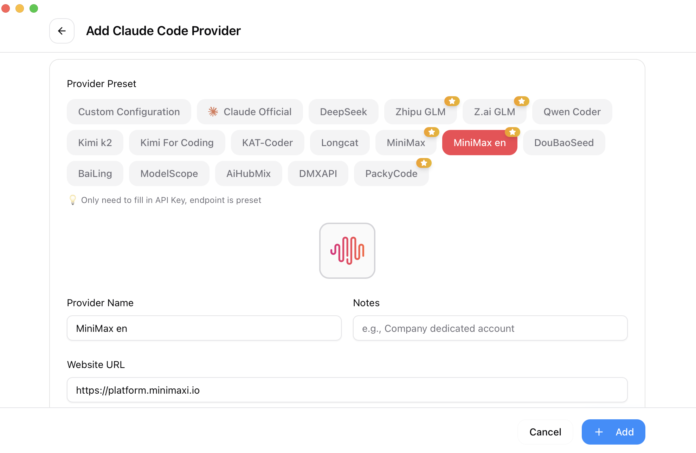

<div align="center">

# 聚游助手

### The All-in-One Manager for Claude Code, Claude Desktop, Codex, Gemini CLI, OpenCode, OpenClaw & Hermes Agent

[](https://github.com/yangp0419/juyou-switcher/releases)
[](https://github.com/yangp0419/juyou-switcher/releases)
[](https://tauri.app/)
[](https://github.com/yangp0419/juyou-switcher/releases/latest)

### 🌐 The Only Official Website: **[github.com/yangp0419/juyou-switcher](https://github.com/yangp0419/juyou-switcher)**

English | [中文](README_ZH.md) | [日本語](README_JA.md) | [Deutsch](README_DE.md) | [Changelog](CHANGELOG.md)

</div>

## Why 聚游助手?

Modern AI-powered coding relies on tools like Claude Code, Claude Desktop, Codex, Gemini CLI, OpenCode, OpenClaw, and Hermes — but each has its own configuration format. Switching API providers means manually editing JSON, TOML, or `.env` files, and there is no unified way to manage MCP and Skills across multiple tools.

**聚游助手** gives you a single desktop app to manage all supported AI tools. Instead of editing config files by hand, you get a visual interface to import providers with one click, switch between them instantly, with 50+ built-in provider presets, unified MCP and Skills management, and system tray quick switching — all backed by a reliable SQLite database with atomic writes that protect your configs from corruption.

- **One App, Seven Tools** — Manage Claude Code, Claude Desktop, Codex, Gemini CLI, OpenCode, OpenClaw, and Hermes from a single interface
- **No More Manual Editing** — 50+ provider presets including AWS Bedrock, NVIDIA NIM, and community relays; just pick and switch
- **Unified MCP & Skills Management** — One panel to manage MCP servers and Skills across Claude, Codex, Gemini, OpenCode, and Hermes with bidirectional sync
- **System Tray Quick Switch** — Switch providers instantly from the tray menu, no need to open the full app
- **Cloud Sync** — Sync provider data across devices via Dropbox, OneDrive, iCloud, or WebDAV servers
- **Cross-Platform** — Native desktop app for Windows, macOS, and Linux, built with Tauri 2
- **Built-in Utilities** — Includes various utilities for first-launch login confirmation, signature bypass, plugin extension sync, and more

## Screenshots

|                  Main Interface                   |                  Add Provider                  |
| :-----------------------------------------------: | :--------------------------------------------: |
|  |  |

## Features

[Full Changelog](CHANGELOG.md) | [Release Notes](docs/release-notes/v3.16.1-en.md)

### Provider Management

- **7 supported tools, 50+ presets** — Claude Code, Claude Desktop, Codex, Gemini CLI, OpenCode, OpenClaw, Hermes; copy your key and import with one click
- **Universal providers** — One config syncs to Claude Code, Codex, and Gemini CLI
- One-click switching, system tray quick access, drag-and-drop sorting, import/export

### Proxy & Failover

- **Local proxy with hot-switching** — Format conversion, auto-failover, circuit breaker, provider health monitoring, and request rectifier
- **App-level takeover** — Independently proxy Claude, Codex, or Gemini, down to individual providers

### MCP, Prompts & Skills

- **Unified MCP panel** — Manage MCP servers across Claude, Codex, Gemini, OpenCode, and Hermes with bidirectional sync and Deep Link import
- **Prompts** — Markdown editor with cross-app sync (CLAUDE.md / AGENTS.md / GEMINI.md) and backfill protection
- **Skills** — One-click install from GitHub repos or ZIP files, custom repository management, with symlink and file copy support

### Usage & Cost Tracking

- **Usage dashboard** — Track spending, requests, and tokens with trend charts, detailed request logs, and custom per-model pricing

### Session Manager & Workspace

- Browse, search, and restore conversation history across supported session sources
- **Workspace editor** (OpenClaw) — Edit agent files (AGENTS.md, SOUL.md, etc.) with Markdown preview

### System & Platform

- **Cloud sync** — Custom config directory (Dropbox, OneDrive, iCloud, NAS) and WebDAV server sync
- **Deep Link** (`juyouswitcher://`) — Import providers, MCP servers, prompts, and skills via URL
- Dark / Light / System theme, auto-launch, auto-updater, atomic writes, auto-backups, i18n (zh/zh-TW/en/ja)

## FAQ

<details>
<summary><strong>Which AI tools does 聚游助手 support?</strong></summary>

聚游助手 supports seven tools: **Claude Code**, **Claude Desktop**, **Codex**, **Gemini CLI**, **OpenCode**, **OpenClaw**, and **Hermes**. Each tool has dedicated provider presets and configuration management.

</details>

<details>
<summary><strong>Do I need to restart the terminal after switching providers?</strong></summary>

For most tools, yes — restart your terminal or the CLI tool for changes to take effect. The exception is **Claude Code**, which currently supports hot-switching of provider data without a restart.

</details>

<details>
<summary><strong>My plugin configuration disappeared after switching providers — what happened?</strong></summary>

聚游助手 provides a "Shared Config Snippet" feature to pass common data (beyond API keys and endpoints) between providers. Go to "Edit Provider" → "Shared Config Panel" → click "Extract from Current Provider" to save all common data. When creating a new provider, check "Write Shared Config" (enabled by default) to include plugin data in the new provider. All your configuration items are preserved in the default provider imported when you first launched the app.

</details>

<details>
<summary><strong>macOS installation</strong></summary>

聚游助手 for macOS may be unsigned when Apple signing certificates are not configured. We recommend using the `.dmg` installer and allowing it in macOS Settings if prompted.

</details>

<details>
<summary><strong>Why can't I delete the currently active provider?</strong></summary>

聚游助手 follows a "minimal intrusion" design principle — even if you uninstall the app, your CLI tools will continue to work normally. The system always keeps one active configuration, because deleting all configurations would make the corresponding CLI tool unusable. If you rarely use a specific CLI tool, you can hide it in Settings. To switch back to official login, see the next question.

</details>

<details>
<summary><strong>How do I switch back to official login?</strong></summary>

Add an official provider from the preset list. After switching to it, run the Log out / Log in flow, and then you can freely switch between the official provider and third-party providers. Codex supports switching between different official providers, making it easy to switch between multiple Plus or Team accounts.

</details>

<details>
<summary><strong>Where is my data stored?</strong></summary>

- **Database**: `~/.juyou-switcher/juyou-switcher.db` (SQLite — providers, MCP, prompts, skills)
- **Local settings**: `~/.juyou-switcher/settings.json` (device-level UI preferences)
- **Backups**: `~/.juyou-switcher/backups/` (auto-rotated, keeps 10 most recent)
- **Skills**: `~/.juyou-switcher/skills/` (symlinked to corresponding apps by default)
- **Skill Backups**: `~/.juyou-switcher/skill-backups/` (created automatically before uninstall, keeps 20 most recent)

</details>

## Documentation

For detailed guides on every feature, check out the **[User Manual](docs/user-manual/en/README.md)** — covering provider management, MCP/Prompts/Skills, proxy & failover, and more.

## Quick Start

### Basic Usage

1. **Add Provider**: Click "Add Provider" → Choose a preset or create custom configuration
2. **Switch Provider**:
   - Main UI: Select provider → Click "Enable"
   - System Tray: Click provider name directly (instant effect)
3. **Takes Effect**: Restart your terminal or the corresponding CLI tool to apply changes (Claude Code does not require a restart)
4. **Back to Official**: Add an "Official Login" preset, restart the CLI tool, then follow its login/OAuth flow

### MCP, Prompts, Skills & Sessions

- **MCP**: Click the "MCP" button → Add servers via templates or custom config → Toggle per-app sync
- **Prompts**: Click "Prompts" → Create presets with Markdown editor → Activate to sync to live files
- **Skills**: Click "Skills" → Browse GitHub repos → One-click install to supported apps
- **Sessions**: Click "Sessions" → Browse, search, and restore conversation history across supported session sources

> **Note**: On first launch, you can manually import existing CLI tool configs as the default provider.

## Download & Installation

### System Requirements

- **Windows**: Windows 10 and above
- **macOS**: macOS 12 (Monterey) and above
- **Linux**: Ubuntu 22.04+ / Debian 11+ / Fedora 34+ and other mainstream distributions

### Windows Users

Download the latest `juyou-switcher-v{version}-Windows.msi` installer or `juyou-switcher-v{version}-Windows-Portable.zip` portable version from the [Releases](../../releases) page.

### macOS Users

**Method 1: Install via Homebrew (Recommended)**

```bash
brew install --cask juyou-switcher
```

Update:

```bash
brew upgrade --cask juyou-switcher
```

**Method 2: Manual Download**

Download `juyou-switcher-v{version}-macOS.dmg` (recommended) or `.zip` from the [Releases](../../releases) page.

> **Note**: macOS builds may be unsigned when Apple signing certificates are not configured. If prompted, allow the app in macOS Settings.

### Arch Linux Users

**Install via paru (Recommended)**

```bash
paru -S juyou-switcher-bin
```

### Linux Users

Download the latest Linux build from the [Releases](../../releases) page:

- `juyou-switcher-v{version}-Linux.deb` (Debian/Ubuntu)
- `juyou-switcher-v{version}-Linux.rpm` (Fedora/RHEL/openSUSE)
- `juyou-switcher-v{version}-Linux.AppImage` (Universal)

> **Flatpak**: Not included in official releases. You can build it yourself from the `.deb` — see [`flatpak/README.md`](flatpak/README.md) for instructions.

<details>
<summary><strong>Architecture Overview</strong></summary>

### Design Principles

```
┌─────────────────────────────────────────────────────────────┐
│                    Frontend (React + TS)                    │
│  ┌─────────────┐  ┌──────────────┐  ┌──────────────────┐    │
│  │ Components  │  │    Hooks     │  │  TanStack Query  │    │
│  │   (UI)      │──│ (Bus. Logic) │──│   (Cache/Sync)   │    │
│  └─────────────┘  └──────────────┘  └──────────────────┘    │
└────────────────────────┬────────────────────────────────────┘
                         │ Tauri IPC
┌────────────────────────▼────────────────────────────────────┐
│                  Backend (Tauri + Rust)                     │
│  ┌─────────────┐  ┌──────────────┐  ┌──────────────────┐    │
│  │  Commands   │  │   Services   │  │  Models/Config   │    │
│  │ (API Layer) │──│ (Bus. Layer) │──│     (Data)       │    │
│  └─────────────┘  └──────────────┘  └──────────────────┘    │
└─────────────────────────────────────────────────────────────┘
```

**Core Design Patterns**

- **SSOT** (Single Source of Truth): All data stored in `~/.juyou-switcher/juyou-switcher.db` (SQLite)
- **Dual-layer Storage**: SQLite for syncable data, JSON for device-level settings
- **Dual-way Sync**: Write to live files on switch, backfill from live when editing active provider
- **Atomic Writes**: Temp file + rename pattern prevents config corruption
- **Concurrency Safe**: Mutex-protected database connection avoids race conditions
- **Layered Architecture**: Clear separation (Commands → Services → DAO → Database)

**Key Components**

- **ProviderService**: Provider CRUD, switching, backfill, sorting
- **McpService**: MCP server management, import/export, live file sync
- **ProxyService**: Local proxy mode with hot-switching and format conversion
- **SessionManager**: Conversation history browsing across supported session sources
- **ConfigService**: Config import/export, backup rotation
- **SpeedtestService**: API endpoint latency measurement

</details>

<details>
<summary><strong>Development Guide</strong></summary>

### Environment Requirements

- Node.js 18+
- pnpm 8+
- Rust 1.85+
- Tauri CLI 2.8+

### Development Commands

```bash
# Install dependencies
pnpm install

# Dev mode (hot reload)
pnpm dev

# Type check
pnpm typecheck

# Format code
pnpm format

# Check code format
pnpm format:check

# Run frontend unit tests
pnpm test:unit

# Run tests in watch mode (recommended for development)
pnpm test:unit:watch

# Build application
pnpm build

# Build debug version
pnpm tauri build --debug
```

### Rust Backend Development

```bash
cd src-tauri

# Format Rust code
cargo fmt

# Run clippy checks
cargo clippy

# Run backend tests
cargo test

# Run specific tests
cargo test test_name

# Run tests with test-hooks feature
cargo test --features test-hooks
```

### Testing Guide

**Frontend Testing**:

- Uses **vitest** as test framework
- Uses **MSW (Mock Service Worker)** to mock Tauri API calls
- Uses **@testing-library/react** for component testing

**Running Tests**:

```bash
# Run all tests
pnpm test:unit

# Watch mode (auto re-run)
pnpm test:unit:watch

# With coverage report
pnpm test:unit --coverage
```

### Tech Stack

**Frontend**: React 18 · TypeScript · Vite · TailwindCSS 3.4 · TanStack Query v5 · react-i18next · react-hook-form · zod · shadcn/ui · @dnd-kit

**Backend**: Tauri 2.8 · Rust · serde · tokio · thiserror · tauri-plugin-updater/process/dialog/store/log

**Testing**: vitest · MSW · @testing-library/react

</details>

<details>
<summary><strong>Project Structure</strong></summary>

```
├── src/                        # Frontend (React + TypeScript)
│   ├── components/
│   │   ├── providers/          # Provider management
│   │   ├── mcp/                # MCP panel
│   │   ├── prompts/            # Prompts management
│   │   ├── skills/             # Skills management
│   │   ├── sessions/           # Session Manager
│   │   ├── proxy/              # Proxy mode panel
│   │   ├── openclaw/           # OpenClaw config panels
│   │   ├── settings/           # Settings (Terminal/Backup/About)
│   │   ├── deeplink/           # Deep Link import
│   │   ├── env/                # Environment variable management
│   │   ├── universal/          # Cross-app configuration
│   │   ├── usage/              # Usage statistics
│   │   └── ui/                 # shadcn/ui component library
│   ├── hooks/                  # Custom hooks (business logic)
│   ├── lib/
│   │   ├── api/                # Tauri API wrapper (type-safe)
│   │   └── query/              # TanStack Query config
│   ├── locales/                # Translations (zh/zh-TW/en/ja)
│   ├── config/                 # Presets (providers/mcp)
│   └── types/                  # TypeScript definitions
├── src-tauri/                  # Backend (Rust)
│   └── src/
│       ├── commands/           # Tauri command layer (by domain)
│       ├── services/           # Business logic layer
│       ├── database/           # SQLite DAO layer
│       ├── proxy/              # Proxy module
│       ├── session_manager/    # Session management
│       ├── deeplink/           # Deep Link handling
│       └── mcp/                # MCP sync module
├── tests/                      # Frontend tests
└── assets/                     # Screenshots & partner resources
```

</details>

## Contributing

Issues and suggestions are welcome!

Before submitting PRs, please ensure:

- Pass type check: `pnpm typecheck`
- Pass format check: `pnpm format:check`
- Pass unit tests: `pnpm test:unit`

For new features, please open an issue for discussion before submitting a PR. PRs for features that are not a good fit for the project may be closed.

## Star History

[](https://www.star-history.com/#yangp0419/juyou-switcher&Date)

## License

MIT © Jason Young
