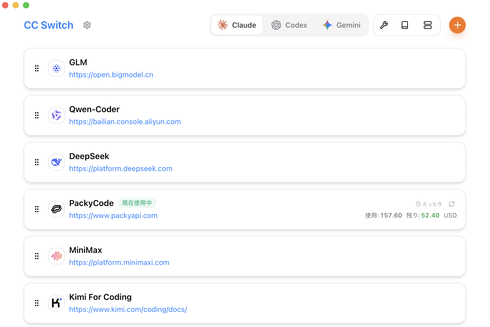
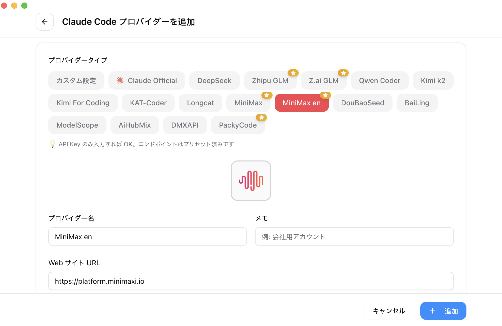

<div align="center">

# 聚游助手

### Claude Code、Claude Desktop、Codex、Gemini CLI、OpenCode、OpenClaw、Hermes Agent のオールインワン管理ツール

[](https://github.com/yangp0419/juyou-switcher/releases)
[](https://github.com/yangp0419/juyou-switcher/releases)
[](https://tauri.app/)
[](https://github.com/yangp0419/juyou-switcher/releases/latest)

### 🌐 唯一の公式サイト：**[github.com/yangp0419/juyou-switcher](https://github.com/yangp0419/juyou-switcher)**

[English](README.md) | [中文](README_ZH.md) | 日本語 | [Deutsch](README_DE.md) | [Changelog](CHANGELOG.md)

</div>

## 聚游助手 を選ぶ理由

最新の AI コーディングは Claude Code、Claude Desktop、Codex、Gemini CLI、OpenCode、OpenClaw、Hermes などのツールに依存していますが、各ツールの設定形式はバラバラです。API プロバイダを切り替えるたびに JSON、TOML、`.env` ファイルを手動で編集する必要があり、複数ツール間で MCP や Skills を統一的に管理する手段もありません。

**聚游助手** は、対応する AI ツールを 1 つのデスクトップアプリで一元管理できます。設定ファイルを手作業で編集する代わりに、ワンクリックでプロバイダをインポートし、瞬時に切り替えられるビジュアルインターフェースを提供します。50 以上の組み込みプリセット、統一 MCP・Skills 管理、システムトレイからの即時切り替え機能を搭載。すべてはアトミック書き込みによる信頼性の高い SQLite データベースに支えられており、設定の破損を防ぎます。

- **1 つのアプリで 7 つのツール** -- Claude Code、Claude Desktop、Codex、Gemini CLI、OpenCode、OpenClaw、Hermes を単一インターフェースで管理
- **手動編集は不要** -- AWS Bedrock、NVIDIA NIM、コミュニティリレーなど 50 以上のプロバイダプリセットを内蔵。選んで切り替えるだけ
- **統一 MCP・Skills 管理** -- 1 つのパネルで Claude、Codex、Gemini、OpenCode、Hermes の MCP サーバーと Skills を双方向同期で管理
- **システムトレイでクイック切り替え** -- トレイメニューから即座にプロバイダを切り替え。アプリを開く必要なし
- **クラウド同期** -- Dropbox、OneDrive、iCloud、または WebDAV サーバー経由でデバイス間のプロバイダデータを同期
- **クロスプラットフォーム** -- Tauri 2 で構築された Windows、macOS、Linux 対応のネイティブデスクトップアプリ
- **便利ツール内蔵** -- 初回起動時のログイン確認、署名バイパス、プラグイン拡張の同期など、さまざまなユーティリティを搭載

## スクリーンショット

|                  メイン画面                   |                  プロバイダ追加                  |
| :-------------------------------------------: | :----------------------------------------------: |
|  |  |

## 特長

[完全な更新履歴](CHANGELOG.md) | [リリースノート](docs/release-notes/v3.16.1-ja.md)

### プロバイダ管理

- **7 つの対応ツール、50 以上のプリセット** -- Claude Code、Claude Desktop、Codex、Gemini CLI、OpenCode、OpenClaw、Hermes。キーをコピーしてワンクリックでインポート
- **ユニバーサルプロバイダ** -- 1 つの設定を Claude Code、Codex、Gemini CLI に同期
- ワンクリック切り替え、システムトレイクイックアクセス、ドラッグ＆ドロップ並び替え、インポート/エクスポート

### プロキシ & フェイルオーバー

- **ローカルプロキシのホットスイッチ** -- フォーマット変換、自動フェイルオーバー、サーキットブレーカー、プロバイダヘルスモニタリング、リクエストレクティファイア
- **アプリレベルのテイクオーバー** -- Claude、Codex、Gemini を個別にプロキシ経由でルーティング、プロバイダ単位で設定可能

### MCP、Prompts & Skills

- **統一 MCP パネル** -- Claude、Codex、Gemini、OpenCode、Hermes の MCP サーバーを管理、双方向同期、Deep Link インポート対応
- **Prompts** -- Markdown エディタ、クロスアプリ同期（CLAUDE.md / AGENTS.md / GEMINI.md）、バックフィル保護
- **Skills** -- GitHub リポジトリまたは ZIP ファイルからワンクリックインストール、カスタムリポジトリ管理、シンボリックリンクとファイルコピーに対応

### 使用量 & コストトラッキング

- **使用量ダッシュボード** -- プロバイダ横断で支出・リクエスト数・トークン使用量を追跡、トレンドチャート、詳細リクエストログ、カスタムモデル価格設定

### Session Manager & ワークスペース

- 対応するセッションソースの会話履歴を閲覧・検索・復元
- **ワークスペースエディタ**（OpenClaw）-- エージェントファイル（AGENTS.md、SOUL.md など）を Markdown プレビュー付きで編集

### システム & プラットフォーム

- **クラウド同期** -- カスタム設定ディレクトリ（Dropbox、OneDrive、iCloud、NAS）および WebDAV サーバー同期
- **Deep Link** (`juyouswitcher://`) -- URL 経由でプロバイダ、MCP サーバー、Prompts、Skills をワンクリックインポート
- ダーク / ライト / システムテーマ、自動起動、自動アップデーター、アトミック書き込み、自動バックアップ、多言語対応（簡体中文/繁體中文/英/日）

## よくある質問

<details>
<summary><strong>聚游助手 はどの AI ツールに対応していますか？</strong></summary>

聚游助手 は **Claude Code**、**Claude Desktop**、**Codex**、**Gemini CLI**、**OpenCode**、**OpenClaw**、**Hermes** の 7 つのツールに対応しています。各ツールに専用のプロバイダプリセットと設定管理が用意されています。

</details>

<details>
<summary><strong>プロバイダを切り替えた後、ターミナルの再起動は必要ですか？</strong></summary>

ほとんどのツールでは、はい。変更を反映するにはターミナルまたは CLI ツールを再起動してください。ただし **Claude Code** は例外で、現在プロバイダデータのホットスイッチに対応しており、再起動は不要です。

</details>

<details>
<summary><strong>プロバイダを切り替えた後、プラグイン設定が消えてしまいました。どうすればよいですか？</strong></summary>

聚游助手 には「共有設定スニペット」機能があり、APIキーやエンドポイント以外の共通データをプロバイダ間で引き継ぐことができます。「プロバイダ編集」→「共有設定パネル」→「現在のプロバイダから抽出」をクリックして、すべての共通データを保存してください。新しいプロバイダを作成する際に「共有設定を書き込む」にチェック（デフォルトで有効）を入れれば、プラグインなどのデータが新しいプロバイダ設定に含まれます。すべての設定項目は、アプリ初回起動時にインポートされたデフォルトプロバイダに保存されており、失われることはありません。

</details>

<details>
<summary><strong>macOS のインストールについて</strong></summary>

聚游助手 の macOS 版は、Apple 署名証明書が未設定の場合は未署名で配布されることがあります。`.dmg` インストーラの使用を推奨します。macOS にブロックされた場合はシステム設定で許可してください。

</details>

<details>
<summary><strong>現在アクティブなプロバイダを削除できないのはなぜですか？</strong></summary>

聚游助手 は「最小限の介入」という設計原則に従っています。アプリをアンインストールしても、CLI ツールは正常に動作し続けます。すべての設定を削除すると対応する CLI ツールが使用できなくなるため、システムは常にアクティブな設定を 1 つ保持します。特定の CLI ツールをあまり使用しない場合は、設定で非表示にできます。公式ログインに戻す方法は、次の質問をご覧ください。

</details>

<details>
<summary><strong>公式ログインに戻すにはどうすればよいですか？</strong></summary>

プリセットリストから公式プロバイダを追加してください。切り替え後、ログアウト／ログインのフローを実行すれば、以降は公式プロバイダとサードパーティプロバイダを自由に切り替えられます。Codex では異なる公式プロバイダ間の切り替えに対応しており、複数の Plus アカウントや Team アカウントの切り替えに便利です。

</details>

<details>
<summary><strong>データはどこに保存されますか？</strong></summary>

- **データベース**: `~/.juyou-switcher/juyou-switcher.db`（SQLite -- プロバイダ、MCP、Prompts、Skills）
- **ローカル設定**: `~/.juyou-switcher/settings.json`（デバイスレベルの UI 設定）
- **バックアップ**: `~/.juyou-switcher/backups/`（自動ローテーション、最新 10 件を保持）
- **Skills**: `~/.juyou-switcher/skills/`（デフォルトでシンボリックリンクにより対応アプリに接続）
- **Skill バックアップ**: `~/.juyou-switcher/skill-backups/`（アンインストール前に自動作成、最新 20 件を保持）

</details>

## ドキュメント

各機能の詳しい使い方については、**[ユーザーマニュアル](docs/user-manual/ja/README.md)** をご覧ください。プロバイダ管理、MCP/Prompts/Skills、プロキシとフェイルオーバーなど、すべての機能を網羅しています。

## クイックスタート

### 基本的な使い方

1. **プロバイダ追加**: 「Add Provider」をクリック → プリセットを選ぶかカスタム設定を作成
2. **プロバイダ切り替え**:
   - メイン UI: プロバイダを選択 → 「Enable」をクリック
   - システムトレイ: プロバイダ名をクリック（即時反映）
3. **反映**: ターミナルまたは対応する CLI ツールを再起動して適用（Claude Code は再起動不要）
4. **公式設定に戻す**: 「Official Login」プリセットを追加し、CLI ツールを再起動してログイン/OAuth フローを実行

### MCP、Prompts、Skills & Sessions

- **MCP**: 「MCP」ボタンをクリック → テンプレートまたはカスタム設定でサーバーを追加 → アプリごとの同期をトグルで切り替え
- **Prompts**: 「Prompts」をクリック → Markdown エディタでプリセットを作成 → 有効化してライブファイルに同期
- **Skills**: 「Skills」をクリック → GitHub リポジトリを閲覧 → 対応アプリへワンクリックでインストール
- **Sessions**: 「Sessions」をクリック → 対応するセッションソースの会話履歴を閲覧・検索・復元

> **補足**: 初回起動時に、既存の CLI ツール設定を手動でインポートしてデフォルトプロバイダとして使用できます。

## ダウンロード & インストール

### システム要件

- **Windows**: Windows 10 以上
- **macOS**: macOS 12 (Monterey) 以上
- **Linux**: Ubuntu 22.04+ / Debian 11+ / Fedora 34+ など主要ディストリビューション

### Windows ユーザー

[Releases](../../releases) ページから最新版の `juyou-switcher-v{version}-Windows.msi` インストーラー、またはポータブル版 `juyou-switcher-v{version}-Windows-Portable.zip` をダウンロード。

### macOS ユーザー

**方法 1: Homebrew でインストール（推奨）**

```bash
brew install --cask juyou-switcher
```

アップデート:

```bash
brew upgrade --cask juyou-switcher
```

**方法 2: 手動ダウンロード**

[Releases](../../releases) から `juyou-switcher-v{version}-macOS.zip` をダウンロードして展開。

> **注意**: 開発者アカウント未登録のため、初回起動時に「開発元を確認できません」と表示される場合があります。一度閉じてから「システム設定」→「プライバシーとセキュリティ」→「このまま開く」をクリックしてください。以降は通常通り起動できます。

### Arch Linux ユーザー

**paru でインストール（推奨）**

```bash
paru -S juyou-switcher-bin
```

### Linux ユーザー

[Releases](../../releases) から最新版の Linux ビルドをダウンロード：

- `juyou-switcher-v{version}-Linux.deb`（Debian/Ubuntu）
- `juyou-switcher-v{version}-Linux.rpm`（Fedora/RHEL/openSUSE）
- `juyou-switcher-v{version}-Linux.AppImage`（汎用）

> **Flatpak**：公式リリースには含まれていません。`.deb` から自分でビルドできます — 手順は [`flatpak/README.md`](flatpak/README.md) を参照してください。

<details>
<summary><strong>アーキテクチャ概要</strong></summary>

### 設計原則

```
┌─────────────────────────────────────────────────────────────┐
│                    Frontend (React + TS)                    │
│  ┌─────────────┐  ┌──────────────┐  ┌──────────────────┐    │
│  │ Components  │  │    Hooks     │  │  TanStack Query  │    │
│  │   (UI)      │──│ (Bus. Logic) │──│   (Cache/Sync)   │    │
│  └─────────────┘  └──────────────┘  └──────────────────┘    │
└────────────────────────┬────────────────────────────────────┘
                         │ Tauri IPC
┌────────────────────────▼────────────────────────────────────┐
│                  Backend (Tauri + Rust)                     │
│  ┌─────────────┐  ┌──────────────┐  ┌──────────────────┐    │
│  │  Commands   │  │   Services   │  │  Models/Config   │    │
│  │ (API Layer) │──│ (Bus. Layer) │──│     (Data)       │    │
│  └─────────────┘  └──────────────┘  └──────────────────┘    │
└─────────────────────────────────────────────────────────────┘
```

**コア設計パターン**

- **SSOT** (Single Source of Truth): すべてのデータを `~/.juyou-switcher/juyou-switcher.db`（SQLite）に集約
- **二層ストレージ**: 同期データは SQLite、デバイスデータは JSON
- **双方向同期**: 切り替え時はライブファイルへ書き込み、編集時はアクティブプロバイダから逆同期
- **アトミック書き込み**: 一時ファイル + rename パターンで設定破損を防止
- **並行安全**: Mutex で保護された DB 接続でレースコンディションを防止
- **レイヤードアーキテクチャ**: Commands → Services → DAO → Database を明確に分離

**主要コンポーネント**

- **ProviderService**: プロバイダの CRUD、切り替え、バックフィル、ソート
- **McpService**: MCP サーバー管理、インポート/エクスポート、ライブファイル同期
- **ProxyService**: ローカル Proxy モードのホットスイッチとフォーマット変換
- **SessionManager**: 対応する全アプリの会話履歴閲覧
- **ConfigService**: 設定のインポート/エクスポート、バックアップローテーション
- **SpeedtestService**: API エンドポイントの遅延計測

</details>

<details>
<summary><strong>開発ガイド</strong></summary>

### 開発環境

- Node.js 18+
- pnpm 8+
- Rust 1.85+
- Tauri CLI 2.8+

### 開発コマンド

```bash
# 依存関係をインストール
pnpm install

# ホットリロード付き開発モード
pnpm dev

# 型チェック
pnpm typecheck

# コード整形
pnpm format

# フォーマット検証
pnpm format:check

# フロントエンド単体テスト
pnpm test:unit

# ウォッチモード（開発に推奨）
pnpm test:unit:watch

# アプリをビルド
pnpm build

# デバッグビルド
pnpm tauri build --debug
```

### Rust バックエンド開発

```bash
cd src-tauri

# Rust コード整形
cargo fmt

# clippy チェック
cargo clippy

# バックエンドテスト
cargo test

# 特定テストのみ実行
cargo test test_name

# test-hooks フィーチャー付きでテスト
cargo test --features test-hooks
```

### テストガイド

**フロントエンドテスト**:

- テストフレームワークに **vitest** を使用
- **MSW (Mock Service Worker)** で Tauri API 呼び出しをモック
- コンポーネントテストに **@testing-library/react** を採用

**テスト実行**:

```bash
# 全テストを実行
pnpm test:unit

# ウォッチモード（自動再実行）
pnpm test:unit:watch

# カバレッジレポート付き
pnpm test:unit --coverage
```

### 技術スタック

**フロントエンド**: React 18 · TypeScript · Vite · TailwindCSS 3.4 · TanStack Query v5 · react-i18next · react-hook-form · zod · shadcn/ui · @dnd-kit

**バックエンド**: Tauri 2.8 · Rust · serde · tokio · thiserror · tauri-plugin-updater/process/dialog/store/log

**テスト**: vitest · MSW · @testing-library/react

</details>

<details>
<summary><strong>プロジェクト構成</strong></summary>

```
├── src/                        # フロントエンド (React + TypeScript)
│   ├── components/
│   │   ├── providers/          # プロバイダ管理
│   │   ├── mcp/                # MCP パネル
│   │   ├── prompts/            # Prompts 管理
│   │   ├── skills/             # Skills 管理
│   │   ├── sessions/           # Session Manager
│   │   ├── proxy/              # Proxy モードパネル
│   │   ├── openclaw/           # OpenClaw 設定パネル
│   │   ├── settings/           # 設定 (Terminal/Backup/About)
│   │   ├── deeplink/           # Deep Link インポート
│   │   ├── env/                # 環境変数管理
│   │   ├── universal/          # クロスアプリ設定
│   │   ├── usage/              # 使用量統計
│   │   └── ui/                 # shadcn/ui コンポーネントライブラリ
│   ├── hooks/                  # カスタムフック（ビジネスロジック）
│   ├── lib/
│   │   ├── api/                # Tauri API ラッパー（型安全）
│   │   └── query/              # TanStack Query 設定
│   ├── locales/                # 翻訳 (zh/zh-TW/en/ja)
│   ├── config/                 # プリセット (providers/mcp)
│   └── types/                  # TypeScript 型定義
├── src-tauri/                  # バックエンド (Rust)
│   └── src/
│       ├── commands/           # Tauri コマンド層（ドメイン別）
│       ├── services/           # ビジネスロジック層
│       ├── database/           # SQLite DAO 層
│       ├── proxy/              # Proxy モジュール
│       ├── session_manager/    # セッション管理
│       ├── deeplink/           # Deep Link 処理
│       └── mcp/                # MCP 同期モジュール
├── tests/                      # フロントエンドテスト
└── assets/                     # スクリーンショット & パートナーリソース
```

</details>

## 貢献

Issue や提案を歓迎します！

PR を送る前に以下をご確認ください：

- 型チェック: `pnpm typecheck`
- フォーマットチェック: `pnpm format:check`
- 単体テスト: `pnpm test:unit`

新機能の場合は、PR を送る前に Issue でディスカッションしてください。プロジェクトに合わない機能の PR はクローズされる場合があります。

## Star History

[](https://www.star-history.com/#yangp0419/juyou-switcher&Date)

## ライセンス

MIT © Jason Young
